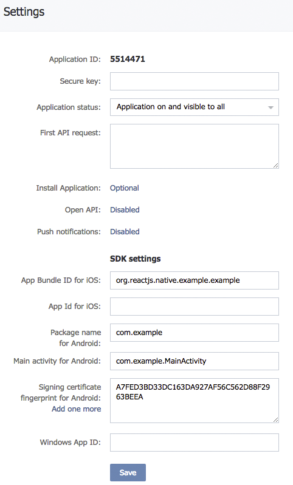

# Installation

## Index

- [Preliminary steps](#preliminary-steps)
- [Helper script](#helper-script)
- [Manual installation](#manual-installation)
  - [Android](#android)
  - [iOS](#ios)
- [Known Issues](#known-issues)

## Preliminary steps

**Firstly**, commit all your previous changes. Messing with native modules can sometimes break your project,
and it's a good idea to have a restore point.

**Secondly**, configure your vk.com app.

For iOS, you will need to fill in `App Bundle for iOS` field.

For Android, you will need to fill in `Package name for Android`, `Main Activity for Android`, `Signing certificate fingerprint for Android` fields.
To obtain the fingerprint, you can follow the [guide](https://new.vk.com/dev/android_sdk) from VK Android SDK documentation.
There is also [helpful API method](API.md#getcertificatefingerprint) that does the same, you can use while developing. For production version you can find this fingerprint in google plat store settings iof your app.



**Thirdly**, install npm package with

```bash
yarn add react-native-vkontakte-login
```

Or alternative `npm` command

## Helper script

To install this module automatically, run

```bash
yarn rn-vk-postlink
```

Answer `y` or `n` to three questions about automatic installation.
You will be also asked for your VK APP ID. It will be stored in `.env` file in your project root, which is handy if you use `react-native-config` or something similar.

The script has several dependencies, all of them listed as peer dependencies of this package.
These dependencies are also part of default react-native project dependency tree, so you should not require them unless you tamper with default react-native dependencies. Otherwise you can install what's missing as dev dependencies.

What the script does:

- Adds VK service activity to `AndroidManifest.xml` ([manual instructions](#android), step 1)
- Adds VK URL schemes to `Info.plist` ([manual instructions](#ios), steps 1 and 2)
- Modifies `AppDelegate.m` to enable opening of vk urls ([manual instructions](#ios), step 3)

## Manual installation

This module supports autolinking, so since RN v0.60 you don't need to modify your gradle files, xcode project or poodfile. If for some reason you need to, read [instructions](installation_v04.md) from v0.4

### Android

1. In your `AndroidManifest.xml`, add following line inside `<application>` element:

   ```xml
   <activity android:name="com.vk.sdk.VKServiceActivity" android:label="ServiceActivity" android:theme="@style/VK.Transparent" />
   ```

2. **(Optional)** Add VK Application ID to resources (`main/res/values/strings.xml`) so the module will initialize with it at startup:
   ```xml
   <integer name="com_vk_sdk_AppId">VK_APP_ID</integer>
   ```
   (In this example, VK_APP_ID should be replaced with 5514471) If you do so, you won't need to call `VKLogin.initialize(vkAppId)` from your JS code.

### iOS

1.  Add following fragment to your `info.plist`:

    ```xml
    <key>LSApplicationQueriesSchemes</key>
    <array>
        <string>vk</string>
        <string>vk-share</string>
        <string>vkauthorize</string>
    </array>
    ```

2.  To use authorization via VK App you need to setup a url-schema of your application.
    Open your application settings then select the Info tab. In the URL Types section click the plus sign.
    Enter vk+APP_ID (e.g. vk5514471) to the **Identifier** and **URL Schemes** fields.

        

        Alternatively, you can add following to your info.plist (of course, you should replace 5514471 with your VK Application ID):

        ```xml
        <key>CFBundleURLTypes</key>
        <array>
            <dict>
                <key>CFBundleTypeRole</key>
                <string>Editor</string>
                <key>CFBundleURLName</key>
                <string>vk5514471</string>
                <key>CFBundleURLSchemes</key>
                <array>
                    <string>vk5514471</string>
                </array>
            </dict>
        </array>
        ```

3.  In your AppDelegate.m, you need to import VK SDK:

    ```objc
    #import <VKSdkFramework/VKSdkFramework.h>
    ```

    and then add following code (both methods are required):

    ```objc
    //iOS 9 workflow
    - (BOOL)application:(UIApplication *)app openURL:(NSURL *)url options:(NSDictionary<NSString *,id> *)options {
       [VKSdk processOpenURL:url fromApplication:options[UIApplicationOpenURLOptionsSourceApplicationKey]];
       return YES;
    }

    //iOS 8 and lower
    -(BOOL)application:(UIApplication *)application openURL:(NSURL *)url sourceApplication:(NSString *)sourceApplication annotation:(id)annotation
    {
       [VKSdk processOpenURL:url fromApplication:sourceApplication];
       return YES;
    }
    ```

4.  **(Optional)** You can add your VK Application ID to `info.plist` so the module will initialize with it at startup:

    ```xml
    <key>VK_APP_ID</key>
    <integer>5514471</integer>
    ```

    If you do so, you won't need to call `VKLogin.initialize(vkAppId)` from your JS code.

## Known issues

`onActivityResult` may not be called if activity started from native module in react context. It is a well known issue that happens from one to another version of react-native. The fix is in forwarding onActivityResult call from your MainActivity.
If your app has been created without Expo

```java
    @Override
    public void onActivityResult(int requestCode, int resultCode, Intent data) {
        super.onActivityResult(requestCode, resultCode, data);
        mReactInstanceManager.onActivityResult(this, requestCode, resultCode, data);
    }
```

It is a bit different if you detached the app from ExpoKit. Expo overrides instance of mReactInstanceManager so we have to look up method in runtime

```java
    @Override
    public void onActivityResult(int requestCode, int resultCode, Intent data) {
        super.onActivityResult(requestCode, resultCode, data);
        mReactInstanceManager.callRecursive("onActivityResult", this, requestCode, resultCode, data);
    }
```
