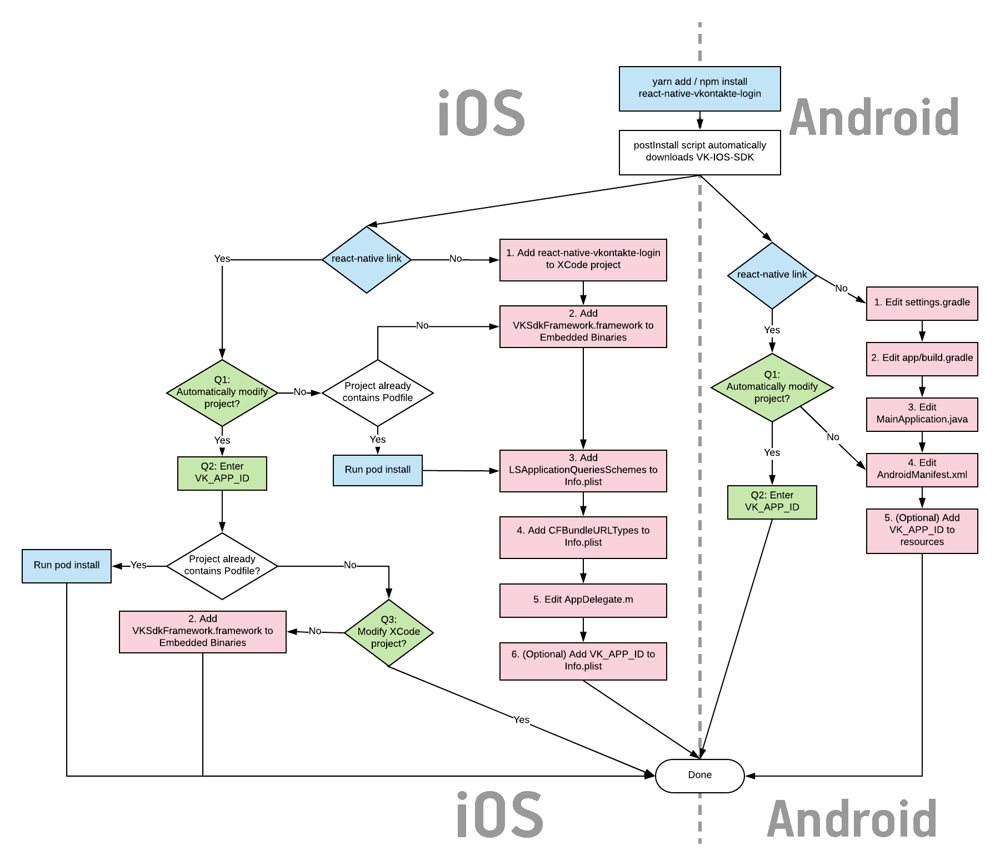
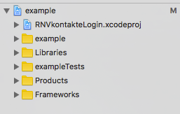
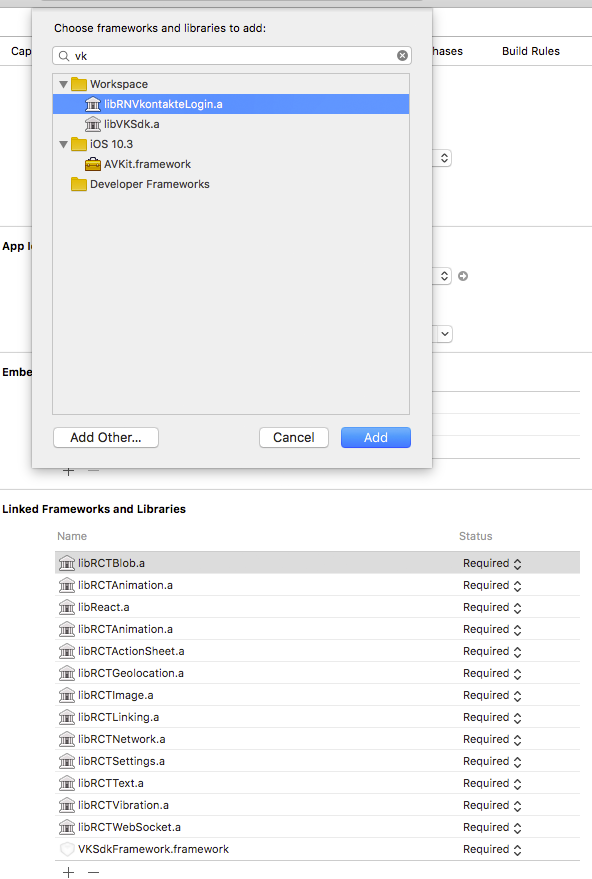
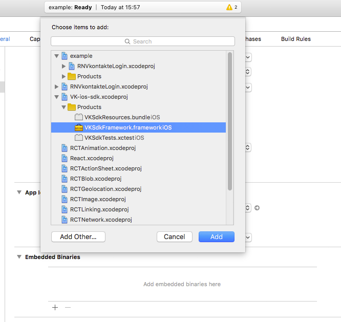

# Installation

## Index

* [Preliminary steps](#preliminary-steps)
* [Automatic installation](#automatic-installation)
* [Installation process overview](#installation-process-overview)
* [Manual installation](#manual-installation)
  - [Android](#android)
  - [iOS](#ios)

## Preliminary steps

**Firstly**, commit all your previous changes. Messing with native modules can sometimes break your project,
and it's a good idea to have a restore point.

**Secondly**, configure your vk.com app.

For iOS, you will need to fill in `App Bundle for iOS` field.

For Android, you will need to fill in `Package name for Android`, `Main Activity for Android`, `Signing certificate fingerprint for Android` fields.
To obtain the fingerprint, you can follow the [guide](https://new.vk.com/dev/android_sdk) from VK Android SDK documentation.
There is also [helpful API method](API.md#getcertificatefingerprint) that does the same, you can use while developing.


**Thirdly**, install npm package with

```bash
yarn add react-native-vkontakte-login
```

Or alternative `npm` command

## Automatic installation

To install this module automatically, run

```bash
react-native link react-native-vkontakte-login
```

Answer `y` to one or two (depending on whether you use Cocoapods or not) questions about automatic installation.
If you answer `n` to any of them, please refer to chart and manual instllation instructions below.

You will be also asked for your VK APP ID. It will be used to automatically modify your Info.plist and setup an url-schema for VK callback.
APP ID then will be stored in `.env` file in your project root, which is handy if you use `react-native-config` or something similar.

If you use Cocoapods in your project, you have to install pods, because this is not done automatically.

```bash
pod install
```

In case of Cocoapods installation it is important to understand that `react-native-vkontakte-login` pod depends on
`React` pod, and you should include it in your Podfile. See Podfile in example project.


## Installation process overview

This section gives you idea on what's going on during installation, what installation options do you have.
You can also refer to the chart provided when something goes wrong during installation and you need to fix it.

To make this module work you need to do the following:

**On Android**: Link the library and the underlying `VK-Android-SDK` with your project, add VKServiceActivity to AndroidManifest

**On iOS**: Link the library and the underlying `VK-IOS-SDK` with your project, setup a url-schema of your application, modify app delegate to correctly open VK urls.

Luckily, most of these tasks are automated either by React-Native or by scripts that come with this project.

This chart shows all the installation steps you can do.

Blue color indicated commands that you have to run in console.

Green color indicates questions that you will be asked by postlink script (in case when you choose to run `react-native link`)

Red color indicates things you have to do manually in XCode/Android Studio (or whatever editor you use to modify native projects).
These steps are numbered and described in detail in manual installation section.
During automatic or semi-automatic installation all or some of them will be for you by the scripts.

Of course, `react-native link` runs for iOS and Android projects at the same time.



## Manual installation

### Android

1. Edit `android/settings.gradle`

    ```gradle
    ...
    include ':react-native-vkontakte-login'
    project(':react-native-vkontakte-login').projectDir = new File(settingsDir, '../node_modules/react-native-vkontakte-login/android')
    ...
    ```
2. Edit `android/app/build.gradle`

    ```gradle
    ...

    dependencies {
        ...
        compile project(':react-native-vkontakte-login')
    }
    ```

3. Edit `android/app/src/main/java/<...>/MainApplication.java`

    ```java
    ...

    import camp.kuznetsov.rn.vkontakte.VKAuthPackage; //<---- import package

    public class MainApplication extends Application implements ReactApplication {
    ...
      @Override
      protected List<ReactPackage> getPackages() {
        return Arrays.<ReactPackage>asList(
            new MainReactPackage(),
            ...
            new VKAuthPackage()//<---- Add package
          );
      }
    ...
    }
    ```

4. In your `AndroidManifest.xml`, add following line inside `<application>` element:

    ```xml
    <activity android:name="com.vk.sdk.VKServiceActivity" android:label="ServiceActivity" android:theme="@style/VK.Transparent" />
    ```

5. **(Optional)** Add VK Application ID to resources (`main/res/values/strings.xml`) so the module will initialize with it at startup:
    ```xml
    <integer name="com_vk_sdk_AppId">VK_APP_ID</integer>
    ```
    (In this example, VK_APP_ID should be replaced with 5514471) If you do so, you won't need to call `VKLogin.initialize(vkAppId)` from your JS code.

### iOS

1. Add `react-native-vkontakte-login` to your XCode project.
    To do so, go to `node_modules/react-native-vkontakte-login/ios` directory inside your project and drag `RNVkontakteLogin.xcodeproj` into your XCode project:

    

    Then add library `libRNVkontakteLogin.a` to `Linked Frameworks and Libraries` section.

    

2. Add `VKSdkFramework.framework` to embedded binaries.
    This can be done in `Embedded binaries` section of General Tab of your project in XCode.

    

3. Add following fragment to your `info.plist`:
      ```xml
      <key>LSApplicationQueriesSchemes</key>
      <array>
          <string>vk</string>
          <string>vk-share</string>
          <string>vkauthorize</string>
      </array>
      ```

4. To use authorization via VK App you need to setup a url-schema of your application.
Open your application settings then select the Info tab. In the URL Types section click the plus sign.
Enter vk+APP_ID (e.g. vk5514471) to the **Identifier** and **URL Schemes** fields.

    

    Alternatively, you can add following to your info.plist (of course, you should replace 5514471 with your VK Application ID):

    ```xml
    <key>CFBundleURLTypes</key>
    <array>
        <dict>
            <key>CFBundleTypeRole</key>
            <string>Editor</string>
            <key>CFBundleURLName</key>
            <string>vk5514471</string>
            <key>CFBundleURLSchemes</key>
            <array>
                <string>vk5514471</string>
            </array>
        </dict>
    </array>
    ```

5. In your AppDelegate.m, you need to import VK SDK:

    ```objc
    #import <VKSdkFramework/VKSdkFramework.h>
    ```

    and then add following code (both methods are required):

    ```objc
    //iOS 9 workflow
    - (BOOL)application:(UIApplication *)app openURL:(NSURL *)url options:(NSDictionary<NSString *,id> *)options {
       [VKSdk processOpenURL:url fromApplication:options[UIApplicationOpenURLOptionsSourceApplicationKey]];
       return YES;
    }

    //iOS 8 and lower
    -(BOOL)application:(UIApplication *)application openURL:(NSURL *)url sourceApplication:(NSString *)sourceApplication annotation:(id)annotation
    {
       [VKSdk processOpenURL:url fromApplication:sourceApplication];
       return YES;
    }
    ```

6. **(Optional)** You can add your VK Application ID to `info.plist` so the module will initialize with it at startup:

    ```xml
    <key>VK_APP_ID</key>
    <integer>5514471</integer>
    ```

    If you do so, you won't need to call `VKLogin.initialize(vkAppId)` from your JS code.